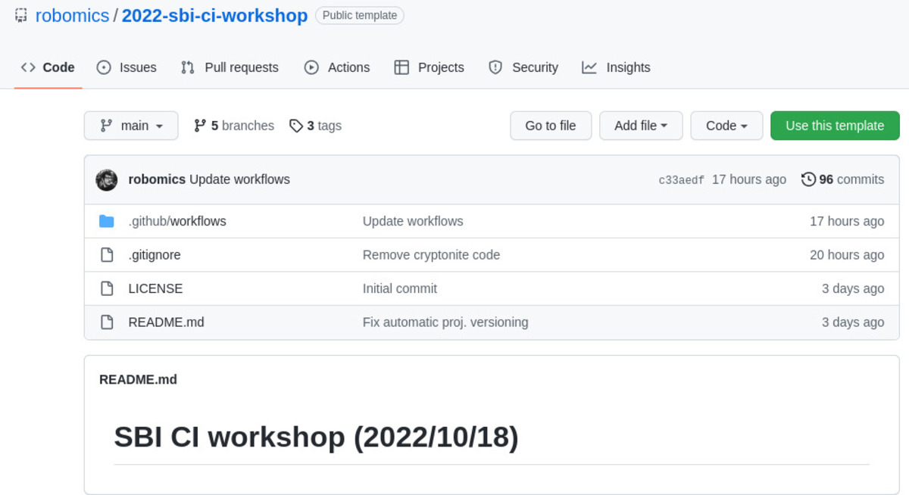
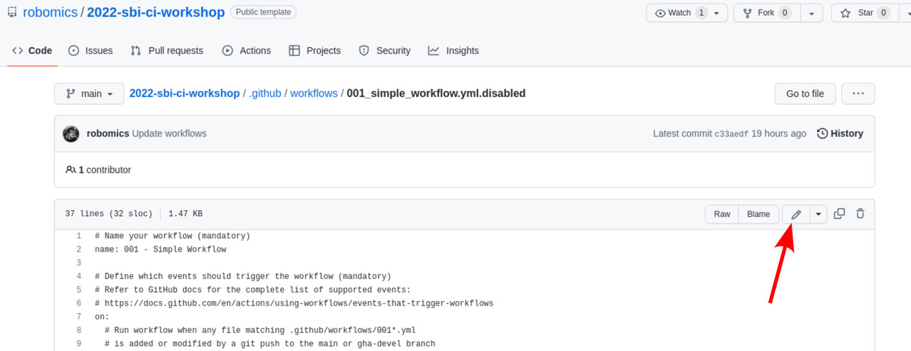
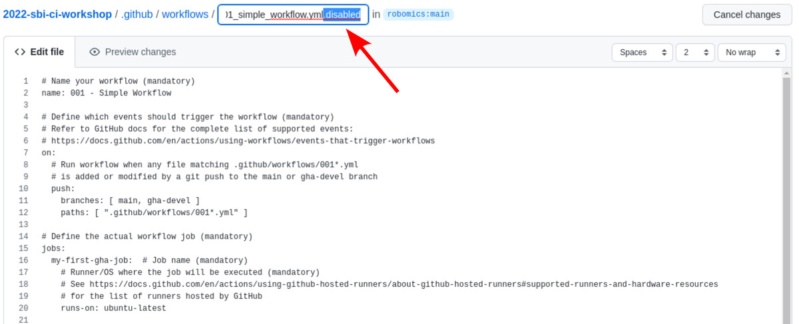
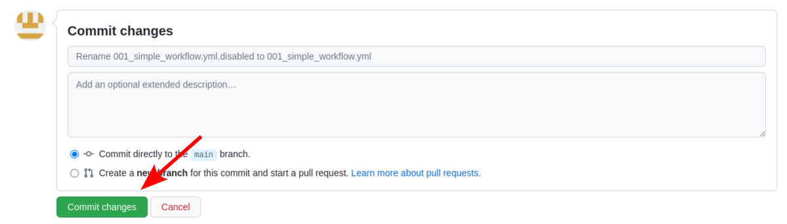
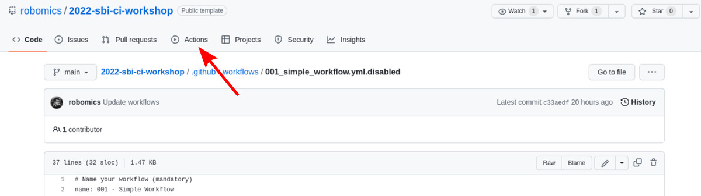
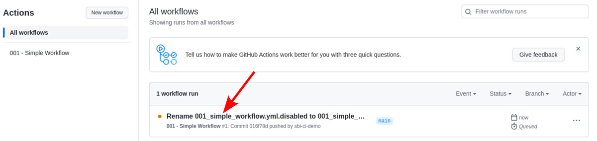
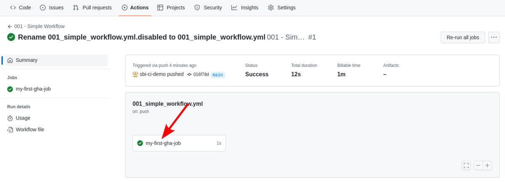
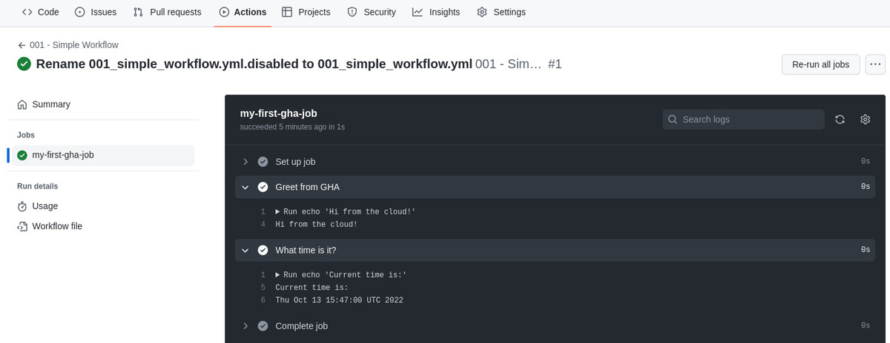

# Introduction to CI/CD with GitHub Actions - SBI workshop \[2022/10/18\]

This repository hosts the code used during the workshop held on 2022/10/18 at the Bioinformatics Center at UiO.

The workshop is organized in two parts:
1. In the first part we will get familiar with the syntax and features of GitHub actions.
2. In the second part we will see how concepts from 1. can be applied to build, test, and publish a Python application on PyPI.

## Repository layout
This repository is organized in 3 branches:
- The `main` branch hosts code for the interactive part of the workshop, with examples and exercises introducing GHA syntax and core concepts. Code in this branch will be used in the first part of the workshop.
- The `cryptonite` branch hosts the code for cryptonite, a simple Python package developed for demo purposes (note: code in this branch is not related in any way to the cryptonite blockchain). 
  Cryptonite is a small library and CLI application for encrypting/decrypting ASCII text using [Caesar cipher](https://en.wikipedia.org/wiki/Caesar_cipher).
  The CLI interface consists of two subcommands:
  - `cryptonite encrypt` reads plain text from stdin and writes the encrypted text to stdout. 
    The encryption key can be specified using the `--key` parameter or through the `CRYPTONITE_KEY` env variable.
  - `cryptonite decrypt` can be used to decrypt messages encrypted with `cryptonite encrypt`.
     CLI options are identical to those for `cryptonite encrypt`.
- The `cryptonite-ci` branch hosts the same code found in the `cryptonite` branch, as well as 3 GHA workflows.
  These workflows show how concepts explored through exercises in the `main` branch can be used to automate building, testing and delivering a Python application.
  Code in this branch will be used in the second part of the workshop.

## Exercise guidelines
To do the exercises you will need a GitHub account.
Once you are logged-in, click on the [Use this template](https://github.com/robomics/2022-sbi-ci-workshop/generate) button on the top right

You will land on a page to create a new GitHub repository using [robomics/2022-sbi-ci-workshop](https://github.com/robomics/2022-sbi-ci-workshop) as template.

The only mandatory field is the _Repository name_ (naming the new repository `2022-sbi-ci-workshop` should be fine).

The exercises do not require a lot of typing, so it is not necessary to clone the repository on your machine: using GitHub's text editor is absolutely fine
(and may actually be a good idea, as the editor comes with syntax highlighting and linting for GitHub Actions).

GitHub Actions looks if a folder named `.github/workflows/` exists, and if it contains any `*.yml` file.

When one of the supported repository event occurs (e.g. one or more commits are pushed, or a pull request is created or updated), GitHub Actions will look for YAML files under
folder `.github/workflows`, and run workflow(s) defined in the YAML file(s) when appropriate.

On the `main` branch, all YAML files under `.github/workflows` are suffixed with `.disabled` and thus
won't be processed by GitHub Actions.

To run workflow #1 (i.e. `001_simple_workflow.yml`) remove the `.disabled` extension (`.github/workflows/001_simple_workflow.yml.disabled -> .github/workflows/001_simple_workflow.yml`)
and push the changes to the `main` branch on your repository.

### How to rename or edit a file from GitHub's WebUI

#### 1. Select the file you want to edit and click on the pencil icon

#### 2. Rename the file (this will enable syntax highlighting and linting) and/or edit the file

#### 3. Scroll to the bottom of the page and customize the commit message and description (optional). Then commit changes

#### 4. Head over to the Actions tab and monitor workflow progress

